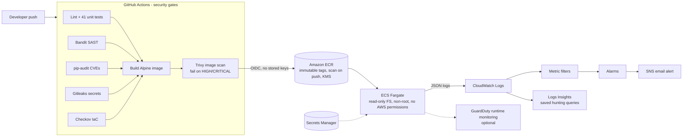

# 🔐 AWS AppSec Pipeline

[](https://github.com/eguidey/aws-appsec-pipeline/actions/workflows/pipeline.yml)


Most teams have a CI/CD pipeline and a monitoring system, but the two rarely talk to each other. The pipeline knows *what* was deployed and whether it passed its scans; the monitoring knows when something suspicious happens at runtime.

This project connects both halves on AWS:

- **Shift left:** every commit passes through five security gates (SAST, dependency CVEs, secrets, IaC misconfigurations, container vulnerabilities) before an image can reach production.
- **Shield right:** the deployed API emits structured JSON security telemetry to CloudWatch, where metric filters and alarms detect brute force, injection attempts and abuse in real time.

---

## Architecture



---

## Pipeline stages

| Stage | Tool | Fails the build when... |
|---|---|---|
| Lint & tests | ruff, pytest (41 tests) | Code quality issue or failing test, including security behaviour tests |
| SAST | Bandit | Medium+ severity issue in application code |
| Dependency scan | pip-audit | Any pinned dependency has a known CVE |
| Secret scan | Gitleaks | A credential appears anywhere in git history |
| IaC scan | Checkov | Terraform or Dockerfile misconfiguration (130 checks passing) |
| Image scan | Trivy | HIGH/CRITICAL vulnerability with an available fix |
| Push | Amazon ECR | Only the **exact image that was scanned** is pushed, via OIDC |
| Deploy | ECS Fargate | Circuit breaker rolls back automatically if new tasks fail health checks |

Pull requests run every security gate but can never deploy: the AWS role only trusts the `main` branch and the `production` environment.

---

## Runtime detections

The API writes one JSON object per line to stdout. ECS ships it to CloudWatch, where each detection is a metric filter plus an alarm:

| Detection | Trigger | Severity | MITRE ATT&CK |
|---|---|---|---|
| `brute_force` | 5+ failed logins from one IP in 5 min | HIGH | T1110 Brute Force |
| `auth_failure_spike` | 10+ failed logins overall in 5 min | MEDIUM | T1110.003 Password Spraying |
| `injection_attempt` | SQLi / XSS / path traversal / command injection signature | MEDIUM | T1190 Exploit Public-Facing Application |
| `rate_limited` | 20+ throttled requests in 5 min | LOW | T1498/T1499 Denial of Service |
| `server_errors` | 5+ HTTP 5xx in 5 min | MEDIUM | Application fault or exploitation |

Example log line:

```json
{"timestamp": "2026-09-27T19:52:14.201+00:00", "level": "ERROR", "event_type": "brute_force_suspected",
 "message": "Repeated failed logins from one source", "service": "appsec-api", "request_id": "5b0c...",
 "method": "POST", "path": "/api/login", "src_ip": "203.0.113.7", "user": "analyst", "failures_in_window": 5}
```

Five **saved Logs Insights queries** (in [`detections/`](detections)) support investigation: top attacking IPs, failed logins by source, injection attempts, successful login after failures (possible compromise), and errors/slow requests.

---

## Security controls

| Layer | Controls |
|---|---|
| **Application** | Strict allow-list input validation · URL-decoding before signature matching (catches encoded/double-encoded payloads) · rate limiting · brute-force tracking · constant-time password comparison · identical errors for bad user/password (no enumeration) · 16 KB body limit · no stack traces to clients · secrets redacted from logs · OWASP security headers · server banner hidden |
| **Container** | Multi-stage Alpine build · non-root user · `pip` removed from runtime image · OS packages patched at build · read-only root filesystem · all Linux capabilities dropped · health check |
| **AWS** | Least-privilege IAM (the app itself has **zero** AWS permissions) · GitHub OIDC with branch/environment-scoped trust · KMS encryption for logs, ECR, secrets and SNS · immutable image tags · secret injected from Secrets Manager at runtime · VPC flow logs · locked default security group · budget alerts |
| **Supply chain** | Pinned dependencies · Dependabot for pip, Docker, Actions and Terraform · every Dependabot PR runs the full pipeline |

---

## Repository layout

```
app/                  Flask API: routes, JSON logging, security controls
tests/                41 pytest tests (API behaviour + security controls)
Dockerfile            Hardened multi-stage Alpine image with Gunicorn
gunicorn.conf.py      Production server settings
infra/                Terraform: VPC, ECR, ECS Fargate, IAM/OIDC, KMS, detections, budget
detections/           CloudWatch Logs Insights hunting queries
scripts/              Attack simulator to validate detections
.github/workflows/    The security pipeline
docs/SETUP.md         Step-by-step deployment guide
```

---

## Quick start (local)

```bash
python -m venv .venv && source .venv/bin/activate      # Windows: .venv\Scripts\activate
pip install -r requirements.txt -r requirements-dev.txt
pytest -v                                              # run the tests
APP_DEMO_PASSWORD='Local-Pass-123!' gunicorn --config gunicorn.conf.py wsgi:app
python scripts/simulate_attacks.py http://127.0.0.1:8000   # watch the JSON security events in the server output
```

With Docker: `docker build -t appsec-api . && docker run -p 8000:8000 -e APP_DEMO_PASSWORD='Local-Pass-123!' appsec-api`

## Deploy to AWS

See **[docs/SETUP.md](docs/SETUP.md)** for the full walkthrough: Terraform, GitHub variables, first deployment, testing the detections, and teardown.

**Cost:** designed to stay within AWS Free Tier credits. No NAT gateway or load balancer. One KMS key (about $1/month) and one secret (about $0.40/month). The Fargate task (about $0.30/day) runs only while deployed. A $10 budget alert is created automatically. `terraform destroy` removes everything.

---

## Design decisions & trade-offs

- **No load balancer:** an ALB costs about $16/month, so the task gets a public IP and the security group restricts access. In production: ALB + AWS WAF + HTTPS (ACM) with the tasks in private subnets.
- **In-memory rate limiting:** it's per worker, which is enough to demonstrate the control and generate telemetry. In production: WAF rate-based rules or Redis.
- **Signature detection, not blocking:** suspicious input is logged rather than blocked, because the validation layer already rejects malformed data and the goal is detection telemetry. A WAF would block at the edge.
- **CloudWatch as the SIEM:** metric filters + alarms + Logs Insights cover detection and investigation cheaply. The same JSON feeds Security Lake, OpenSearch or Splunk without changes.

## Roadmap

- [ ] AWS WAF with managed rule groups in front of an ALB
- [ ] Forward alarms to Security Hub as findings
- [ ] Sign images with cosign and verify before deploy
- [ ] Generate an SBOM (Syft) and attach it to each release
- [ ] Pin third-party GitHub Actions to commit SHAs

---

Built by **Ian Guidry** · [ianguidry.com](https://ianguidry.com) · [LinkedIn](https://www.linkedin.com/in/ian-guidry-5823ab25b/)
